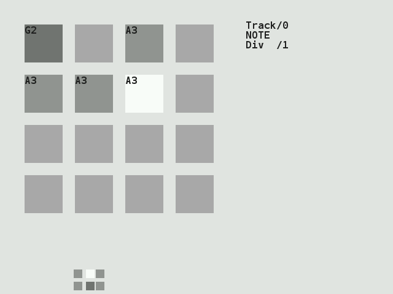

## Picoloop Tutorial (PocketChip version) 

Welcome to **Picoloop**!

**Picoloop** is a synth and a step sequencer made by Yoyz. In this tutorial, we'll make a tour of the basic functionalities of **Picoloop**. The commands described here are adapted for the usage on PocketChip.

 

### Starting 

First, get **Picoloop** at https://github.com/yoyz/audio/

The Windows and PSP binaries can be found in the [Releases](https://github.com/yoyz/audio/releases) tab.

If you're using Linux, you'll probably have to compile it yourself (instructions are provided in the readme). You can also tweak some parameters, found in the Master.h file, before the compilation, such as the MAX_PATTERN_BY_PROJECT variable to increase the pattern slots. 

**Picoloop** is not yet available for Mac OS X, but some developpements are made in this direction at the moment.

The requirements for starting the application are:

 * The picoloop binary itself (called "picoloop" or "PatternPlayer_#####" after you've just compiled it, you can rename it if needed)
 * the font.ttf file
 * optionnally the patch/MDADrum/ folder if you want to get some electronic drums
 * the bank/ folder to store your creations.

Run the **Picoloop** binary. You will be presented to a setting panel. Navigate with ←, →, ↑ and ↓ and choose the color theme (palette) you prefer.

Then make sure the AudioOutput matches your soundcard. Eventually make it select and display "default".

 

To exit this panel and start making music, validate with Right Shift.  In the case it crashes, it might be because the soundcard configuration was not correct. Restart the binary and select another card setting.

You will be presented to the **Picoloop** main window. 

 

With this color scheme, the 16 steps are in light grey. The moving dark grey cursor is the current sounding note. The cursor for edition is in white and you cannot move it right now (you're in *Menu mode*). Below the 16 steps is the menu. It displays:

    [ ENV ]  Note  OSC  VCO  LFO  FLTR

Move left or right to select the parameter you want to use. 

### Entering notes 

At the moment, select Note with the Right Ctrl key. Now you are in *Edit mode*, and you can navigate within the 16 steps with the ←, →, ↑ and ↓ arrows. Insert your first note with the Right Shift key. It will be a C2. 

You can change the value of this note by holding Right Ctrl and typing on the arrows. ← or → for decreasing or increasing 1/2 tone, ↑ or ↓ for increasing or decreasing 1 octave. Make it for example G2. Now select other empty cases and type Right Shift for adding more notes and Right Ctrl for changing their values. Delete an existing note with Right Shift. The next note entered with Right Shift will be the previous value which was deleted (delete an A3, next one with be A3 then).

 

There are a total of 4 tracks which can play together. To change the current working track, go back to the menu with the ESC key. Use the ↑ and ↓ arrows to select the track. It will display Track/0, Track/1 etc. Now you can enter more notes in this other track.

To change the sound of the current notes, select ENV in the menu, and validate with Right Ctrl, the menu will disappear, meaning you can enter notes or change values. In the ENV parameters, you can alter the sound with Right Ctrl + arrows. Try to play with the two parameters. You end up with something like that:

  

Now if you type the Enter key, you'll access more parameters, which you can change in a similar way. In this mode, you alter parameters for individual notes, if you want to change all the inserted notes for the current track, exit the *edit mode* with the ESC key, and use Right Shift + arrows to change all the steps together.

### Saving and loading music 

Now it's time to save your first work!

Exit the *edit mode* with ESC if you're still in it, and type again ESC to enter the second menu (*Menu2*). 

It will display:

    L/S  [ BANK ]  PSH  MAC  FX  BPM

Select L/S (*Load/Save*) and enter the menu with Right Ctrl.

It will look like this:

  

This screen is for saving individual patterns, but also to organise them into a whole song.

The menu on top represents your tracks. The cursor on this screenshot is on the top 0E column. To save an individual track, select an empty slot and type Right Ctrl + ↓. Now the slot will be lighter (with this grey theme). To save all the 4 tracks (one pattern), type Right Shift + ↓, the whole column will be lighter.

To reload you tracks later, select a column and type Right Shift + ↑. To load an individual slot, type Right Ctrl + ↑. Beware, there is no warning so it might erase your current work.

Now you can assemble your tracks with the order list (under the Song Position label). Go into this list with the Enter key. 

Modify the list order with the arrows and the Right Ctrl key.

You can define Loop start position with Right Shift + ↑. As soon as you define this, the song with start to play. And you can define Loop end position with Right Shift + ↓. Change the values of the list with Right Ctrl + ↑/↓ 

Important: 

1. When you're in the order list, your changes are saved only when you exit it to the pattern editor with ESC. If you close **Picoloop** before doing this, your changes won't be saved!
1. When you're in the pattern editor, the data are written in a buffer, and you must save the current pattern in the track grid before playing your song from the order list (otherwise the changes in the pattern won't be saved). 
You can only save the pattern in the same row as the pattern number you've worked in. For example a pattern in the Track/1 can only be saved in the second row in the track grid (tracks are starting from 0, Track/0 is the first one, Track/1 is the second one)

Each bank is for storing a different project (=song). We advice you create a text file with a numbered reference to all your songs and projects, because there is no way to name a bank into picoloop.

You can choose your bank at picoloop start up, otherwise use the 'bank' menu, select the bank number to load with the Right Ctrl key, then press the Enter key.

There is no option for backing up a bank you're working on, so it can be a good idea to save your whole bank/ folder from time to time. On Linux / Unix systems, you can use a script like this from the command line:

    zip -r bank_picoloop_`date +%Y-%m-%d_%H:%M`.zip bank

On MS Windows you can right-clic on the 'bank' folder and zip it, then rename it with the current date.

To record your music, you can either (obviously) plug a recorder to the line-out of your computer or device, but you can also set this environment setting before starting picoloop:

    export DUMP_AUDIO=1 && picoloop

### Exploring new horizons 

As we've seen earlier, we can change the pitch value (note) of a step, but also some parameters such as ENV (enveloppe), OSC (oscillator), VCO (a kind of mixer), LFO and FLTR (filter). If you press Enter while in a parameter menu, you can also get more parameters related to the first one (for example in the ENV menu, you'll get first Attack/Release, and after pressing Enter you'll get Decay/Sustain, one more press on Enter and it's Trig/Amplification). Note: on some engines, ENV is replaced by A/R.

But we can also change the whole engine, using the "MAC" menu in *menu2*. The different engines are (from up to down):

 * Psynth (default) : PicoSynth, soustractive synth with 2 oscillators (lightweight).
 * SID : emulation of the MOS SID 6581/8580 soundchip (found on Commodore C64 8-bit computers), based on the resid engine
 * Mdrum : MDA Drumsynth (you need the patches in the picoloop/patch/MDADrum/ folder)
 * Mdiout : midi out
 * Tsynth : Twytch/Helm. Needs high ressources.
 * 0303 : based on Open303, a free, open source emulation of the Roland TB-303 synthesizer. Needs high ressources.
 * Csynth : Cursynth, a soustractive synth with 2 oscillators. Needs high ressources.
 * PBS : PBSynth, another soustractive synth with 2 oscillators (lightweight).
 * Pdrum : Picodrum, for making rythms (kicks, hats, snares...)
 * OPL2 : FM synthesis
 * *LGPT : sampler using the little piggy tracker engine (in development, only available in latest releases of picoloop)*

On some less powerful machines (PSP, raspberry pi), the high ressources engines are not enabled.

Refer to the picoloop README for all the parameters or experiment yourself.

There is a thread about **Picoloop** on the Chipmusic.org forum: https://chipmusic.org/forums/topic/13624/picoloop-nanoloop-clone/

#### Using a gamepad on computers 

You can use a gamepad instead of the keyboard to make music with picoloop. This tip will work on linux (PC, raspberry, picoloop version).

This example with work with SNES-like USB gamepad you can get for a few euros on ebay.

Install qjoypad and put those files into your ~/.qjoypad3 folder:

**layout:**

    picoloop

**picoloop.lyt:**

    # QJoyPad 4.1 Layout File
    
    Joystick 1 {
    	Axis 1: +key 114, -key 113
    	Axis 2: +key 116, -key 111
    	Button 1: key 62
    	Button 2: key 37
    	Button 3: key 64
    	Button 4: key 105
    	Button 5: key 22
    	Button 6: key 23
    	Button 9: key 9
    	Button 10: key 36
    }
    

On debian/ubuntu/linux mint systems you can just do:

    sudo apt install qjoypad
    cd
    mkdir .qjoypad3
    cd .qjoypad3/
    wget https://raw.githubusercontent.com/farvardin/picoloop-manual/master/tools/qjoypad/.qjoypad3/layout
    https://raw.githubusercontent.com/farvardin/picoloop-manual/master/tools/qjoypad/.qjoypad3/picoloop.lyt

Then plug your gamepad and start qjoypad. You might need to select the picoloop layout in the menu in the systemtray.

## Picoloop Memo (PocketChip version) 

 

| Menu mode ||
|-----|----------|
|← / → |move backward/forward in the menu|
|↑ / ↓ |select the track from 0 to track 3|
|Right Ctrl |do nothing|
|Right Shift + ←/→/↑/↓ |edit all step at once|
|Right Shift |enter the edit mode|
|TAB |go to the next     16 step on the same track|
|Backspace |go to the previous 16 step on the same track|
|ESC |call menu2 or menu1|

| Edit mode ||
|-----|----------|
|← / → |select next step|
|↑ / ↓ |select step+4, step-4|
|Right Ctrl |enter a note in a step, it works as a cut/paste|
|Right Shift + ←/→/↑/↓ |edit the current step|
|Right Shift |do nothing|
|TAB |go to the next     16 step on the same track|
|Backspace |go to the previous 16 step on the same track|
|ESC |call menu2 or menu1|
|Enter |cycle between the different parameters|

#### L/S menu 

| Bank ||
|-----|----------|
|Right Ctrl + ↓ |Save the current track on the selected slot|
|Right Shift + ↓ |Save your current pattern (group of 4 tracks)|
|Right Ctrl + ↑ |Load a track (replace current)|
|Right Shift + ↑ |Load a 4 tracks pattern|

| Song position (order list) ||
|-----|----------|
|Right Shift + ↑ |Define Loop start position|
|Right Shift + ↓ |Define Loop end position|
|Right Ctrl + ↑/↓ |Change the values|
|Right Ctrl + ←/→ |copy value left or right|
|Right Shift + ←/→ |insert or delete value (shift patterns)|

| PSH menu ||
|-----|----------|
|Right Shift+↑ |Increase the track size (16 steps block)|
|Right Shift+↓ |Decrease the track size (16 steps block)|
|Right Shift+→ |Increase the track size (1 step)|
|Right Shift+← |Decrease the track size (1 step)|
|TAB and Backspace |Navigate into the new steps (-16 or +16)|

### Other commands 

| Volume ||
|-----|----------|
|ESC+↑ |Increase volume|
|ESC+↓ |Decrease volume|

Get picoloop at https://github.com/yoyz/audio/

------
Made by [Garvalf (http://garvalf.online.fr)](http://garvalf.online.fr) with the [textallion](https://bitbucket.org/farvardin/textallion) word processor and the [txt2tags](http://www.txt2tags.org) syntax.

